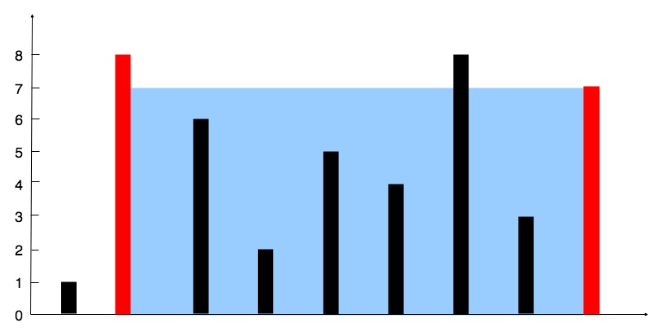

# Container With Most Water (LeetCode 11)

Given an integer array `height` of length `n`, there are `n` vertical lines drawn such that the two endpoints of the i-th line are `(i, 0)` and `(i, height[i])`.

Find two lines that together with the x-axis form a container, such that the container contains the most water. Return the maximum amount of water a container can store. You may not slant the container.


## Examples

Example 1

Input

```
height = [1,8,6,2,5,4,8,3,7]
```

Output

```
49
```

Explanation: The two lines that form the maximum container give area 49.

Example 2

Input

```
height = [1,1]
```

Output

```
1
```

## Constraints

- `n == height.length`
- `2 <= n <= 10^5`
- `0 <= height[i] <= 10^4`

## Approach (Two Pointers)

- Use two pointers `l = 0` and `r = n-1`.
- At each step compute area = `min(height[l], height[r]) * (r - l)` and update the maximum.
- Move the pointer pointing to the shorter line inward (if `height[l] < height[r]` then `l++`, else `r--`).
- Repeat until `l >= r`.

Time complexity: O(n). Space complexity: O(1).

## Files

- Solution implementation: [main.cpp](main.cpp)
